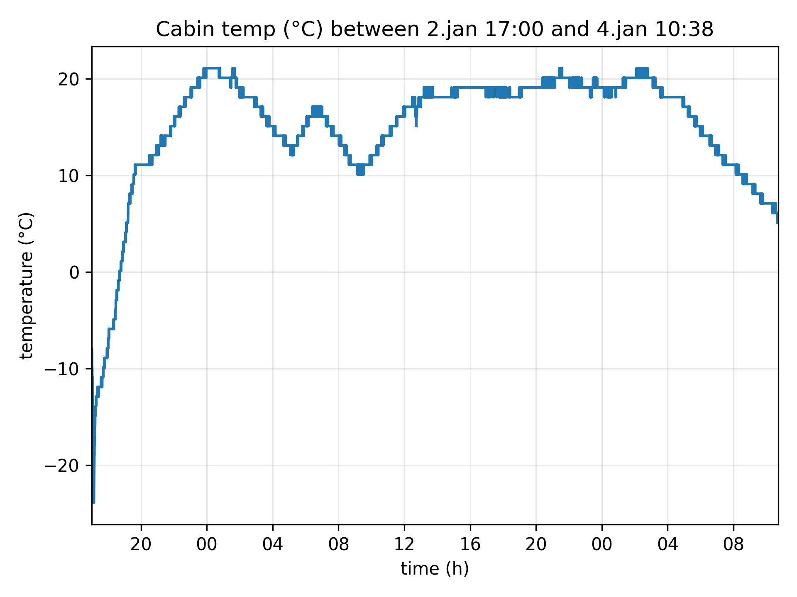

# ESP Data Logger

ESP-IDF project for periodic sensor sampling and flash storage with serial interface control.

## Features

- Periodic sensor data sampling with configurable intervals (5ms minimum)
- Persistent flash storage of timestamped sensor readings
- Settings and state preservation across power cycles
- UART command interface for configuration and data retrieval
- CSV data export via serial console
- Configurable logging period and log levels
- Example implementation using ESP32-S2 internal temperature sensor (easily adaptable for other sensors)

## Hardware Requirements

- **ESP32 family chip** (tested on ESP32-S2)
- Any sensor compatible with ESP-IDF (I2C, SPI, ADC, etc.)
- Current implementation uses ESP32-S2 internal temperature sensor as demonstration (easy to swap for other sensors)

## Prerequisites

- [ESP-IDF v5.0+](https://docs.espressif.com/projects/esp-idf/en/latest/esp32/get-started/index.html)
- USB-to-serial connection for UART communication

## Building the Project

Refer to the [ESP-IDF Getting Started Guide](https://docs.espressif.com/projects/esp-idf/en/latest/esp32s2/get-started/index.html) for initial setup.

Build and flash the project:

```bash
# Build
idf.py build

# Flash and monitor
idf.py -p PORT flash monitor
```

Replace `PORT` with your serial port (e.g., `/dev/ttyUSB0` on Linux, `COM3` on Windows).

## Project Structure

```
ESP_sample_sleep_project/
├── main/
│   └── ESP_sample_sleep_project.c    # Main application logic and sensor interface
├── components/
│   └── uart_handler/                 # UART communication component
│       ├── include/uart_handler.h
│       └── src/uart_handler.c
├── partitions.csv                    # Custom partition table
└── sdkconfig                         # Project configuration
```

## Usage

### UART Commands

Connect to the device via serial terminal at **115200 baud**. The following commands are available:

| Command | Description |
|---------|-------------|
| `help` | Display available commands |
| `start` | Begin logging sensor data |
| `stop` | Stop logging data |
| `info` | Show system status (logging period, state, storage usage) |
| `set period <ms>` | Set logging period in milliseconds (minimum 5ms) |
| `set level <0-5>` | Set log level (0=none, 1=error, 2=warn, 3=info, 4=debug, 5=verbose) |
| `dump [count]` | Export last N entries as CSV (omit count for all entries) |
| `clear [count]` | Remove last N entries (omit count for all entries) |
| `reset` | Erase all data and reset to initial state |

### Example Session

```
IDLE - Type 'help' for commands
> info

System Information:
  Project: ESP_sample_sleep_project
  Logging period: 5000 ms
  Current state: IDLE
  Entries logged: 0 / 51200
  Remaining space: 51200 entries (0.0% full)
  Log level: INFO

> start
Started logging

> dump 5
timestamp_ms,temperature_C
60000,42.13
65000,42.25
70000,42.18
75000,42.31
80000,42.22

Dumped 5 entries
```

### Example Usage (Temperature Sensor)

Measured and exported temperature fluctuations during stay at cold cabin using internal CPU temperature sensor, logging interval 5000ms. Initial temperature reading from ESP32-S2 being in backpack, left outside in ca. -30° (initial slump), afterwards left inside of cabin for duration of stay. Cabin temperature measured with external sensor to be -14° at arrival. Device persisted after multiple power cycles and exported data for plotting.

Data captured using minicom as serial monitor with file logging enabled:
```bash
minicom --capturefile=CabinTemp.txt
```


## Configuration

Project uses a custom partition table (`partitions.csv`) with a dedicated storage partition (subtype `0x40`) for data logging. Settings are stored at the beginning of the partition, with log entries starting at offset 4096 bytes. Feel free to extend partition for increased storage or changing starting offset according to application binary size.

### Data Splice Detection

After power cycles, a 60-second gap is added to timestamps to mark data splices in the continuous log, making it easy to identify where the device was reset. Feel free to change time period or gap detection.

## Adapting for Other Sensors

The project is designed to be easily adapted for any sensor. To use a different sensor:

1. Replace the temperature sensor initialization code in `ESP_sample_sleep_project.c:412-434`
2. Update the sensor reading code in the LOGGING state at `ESP_sample_sleep_project.c:456-462`
3. Modify the `log_entry_t` struct if you need different data fields (e.g., humidity, pressure, etc.)
4. Update CSV headers in the dump command accordingly

The flash storage, UART interface, and state management remain unchanged regardless of sensor type.

## Future Planned Work

- Implement dedicated FreeRTOS task for sampling
- Add light or deep sleep mode support

## License

Apache License 2.0

---

**Status:** V1.0 - Tested and working (without sleep mode or dedicated sampling task)
